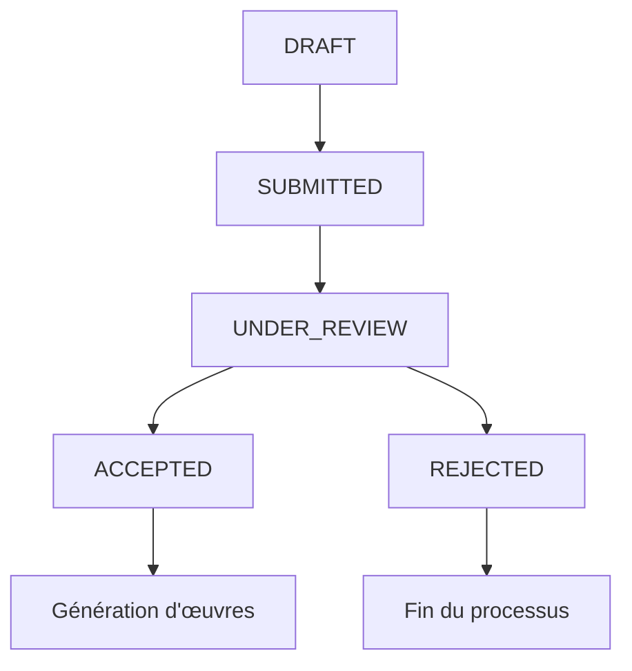

# 📁 Gestion des Projets - PDG Dashboard

Cette page permet au PDG de gérer tous les projets soumis par les concepteurs dans le système Lahamarchand.

## 🎯 Fonctionnalités principales

### 📋 Consultation des projets
- **Liste complète** : Affichage de tous les projets avec leurs informations détaillées
- **Informations affichées** :
  - Titre et description du projet
  - Discipline associée
  - Concepteur responsable
  - Date de création et de soumission
  - Statut actuel
  - Œuvres générées (si applicable)

### 🔍 Filtrage et recherche
- **Recherche textuelle** : Par titre, description, concepteur ou discipline
- **Filtre par statut** :
  - `DRAFT` : Brouillon
  - `SUBMITTED` : Soumis (en attente de validation)
  - `UNDER_REVIEW` : En révision
  - `ACCEPTED` : Accepté
  - `REJECTED` : Refusé
- **Filtre par discipline** : Toutes les disciplines disponibles

### 📊 Statistiques en temps réel
- **Total des projets** : Nombre total de projets
- **Projets soumis** : En attente de validation
- **Projets en révision** : En cours d'examen
- **Projets acceptés** : Validés par le PDG
- **Projets refusés** : Rejetés avec motif

### 👁️ Détails d'un projet
- **Fiche complète** : Toutes les informations du projet
- **Historique** : Dates importantes (création, soumission, validation)
- **Œuvres associées** : Liste des œuvres générées à partir du projet
- **Métadonnées** : Concepteur, discipline, statut, etc.

### ✅ Validation des projets
- **Accepter un projet** :
  - Changement de statut vers `ACCEPTED`
  - Notification automatique au concepteur
  - Possibilité de générer des œuvres
  
- **Refuser un projet** :
  - Changement de statut vers `REJECTED`
  - Obligation de fournir un motif de refus
  - Notification automatique au concepteur avec le motif

### 🔔 Notifications automatiques
- **Projet accepté** : Notification de succès au concepteur
- **Projet refusé** : Notification avec motif de refus
- **Suivi en temps réel** : Mise à jour automatique des statuts

## 🗂️ Structure des données

### Interface Project
```typescript
interface Project {
  id: string;
  title: string;
  description: string;
  status: "DRAFT" | "SUBMITTED" | "UNDER_REVIEW" | "ACCEPTED" | "REJECTED";
  createdAt: string;
  submittedAt?: string;
  reviewedAt?: string;
  discipline: {
    id: string;
    name: string;
  };
  concepteur: {
    id: string;
    name: string;
    email: string;
    role: string;
  };
  reviewer?: {
    id: string;
    name: string;
    email: string;
  };
  works: Work[];
}
```

### Workflow des statuts


## 🎨 Interface utilisateur

### 📱 Layout principal
- **En-tête** : Titre, description, bouton d'actualisation
- **Statistiques** : Cartes avec compteurs et icônes
- **Filtres** : Recherche, statut, discipline
- **Liste des projets** : Cards avec actions contextuelles

### 🎯 Actions contextuelles
- **Projets soumis** : Boutons "Accepter" et "Refuser"
- **Tous les projets** : Bouton "Détails" pour voir la fiche complète
- **Projets acceptés** : Affichage des œuvres générées

### 🔔 Système de notifications
- **Composant NotificationBell** : Cloche avec compteur de notifications non lues
- **Types de notifications** :
  - `PROJECT_ACCEPTED` : Projet accepté
  - `PROJECT_REJECTED` : Projet refusé
  - `PROJECT_SUBMITTED` : Nouveau projet soumis
  - `WORK_SUBMITTED` : Œuvre soumise
  - `USER_APPROVED` : Utilisateur approuvé

## 🔧 APIs utilisées

### Endpoints principaux
- `GET /api/projects` : Récupération de tous les projets
- `PUT /api/projects` : Mise à jour du statut d'un projet
- `POST /api/notifications` : Création de notifications
- `GET /api/notifications` : Récupération des notifications
- `PUT /api/notifications` : Marquer comme lu

### Client API
```typescript
// Récupérer tous les projets
const projects = await apiClient.getProjects();

// Mettre à jour un projet
const updatedProject = await apiClient.updateProject(projectId, {
  status: "ACCEPTED",
  reviewedAt: new Date().toISOString()
});

// Créer une notification
await apiClient.createNotification({
  userId: concepteurId,
  title: "Projet accepté",
  message: "Votre projet a été accepté par le PDG",
  type: "PROJECT_ACCEPTED"
});
```

## 🧪 Tests et validation

### Script de test
```bash
# Créer des projets de test avec différents statuts
node scripts/test-project-management.js
```

### Scénarios de test
1. **Création de projets** : Différents statuts et disciplines
2. **Validation PDG** : Accepter/refuser des projets
3. **Notifications** : Vérifier l'envoi automatique
4. **Filtrage** : Tester tous les filtres disponibles
5. **Détails** : Vérifier l'affichage complet des informations

## 📈 Métriques et suivi

### Statistiques disponibles
- Nombre total de projets
- Répartition par statut
- Temps moyen de validation
- Taux d'acceptation/rejet
- Projets par discipline
- Concepteurs les plus actifs

### Logs d'audit
- Toutes les actions de validation sont enregistrées
- Historique complet des changements de statut
- Traçabilité des décisions du PDG

## 🚀 Améliorations futures

### Fonctionnalités prévues
1. **Workflow de révision** : Processus en plusieurs étapes
2. **Commentaires** : Système de commentaires sur les projets
3. **Échéances** : Gestion des délais de validation
4. **Rapports** : Génération de rapports de gestion
5. **Collaboration** : Validation par plusieurs PDG
6. **Templates** : Modèles de projets prédéfinis

### Optimisations techniques
1. **Pagination** : Pour les grandes listes de projets
2. **Cache** : Mise en cache des données fréquemment consultées
3. **Real-time** : Mise à jour en temps réel des statuts
4. **Export** : Export des données en Excel/PDF
5. **Recherche avancée** : Filtres multiples et recherche sémantique

---

**Note** : Cette page est accessible uniquement aux utilisateurs avec le rôle `PDG` et constitue le centre de contrôle principal pour la gestion des projets dans le système Lahamarchand.

