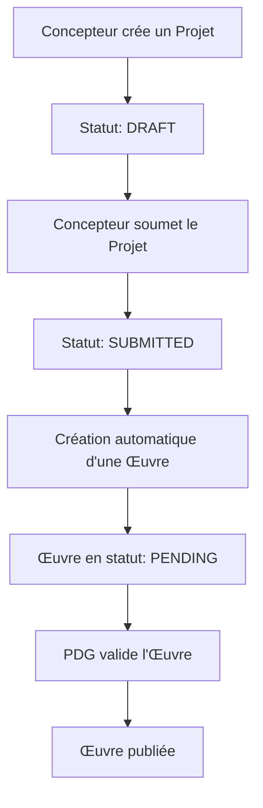
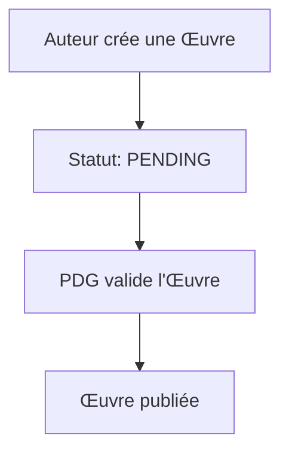
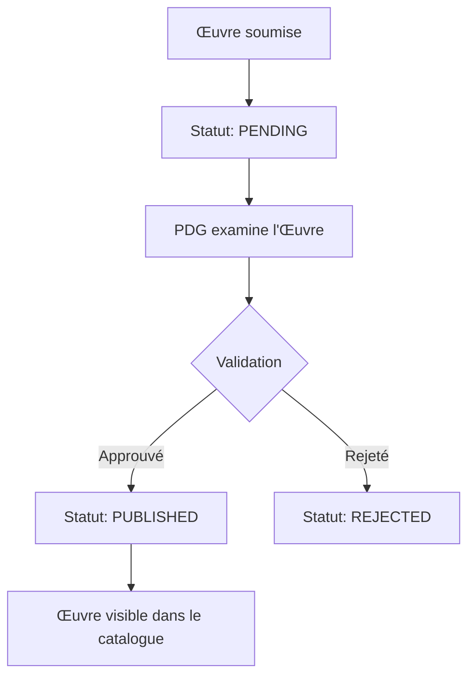

# 🏗️ Workflows Projet et Œuvre - Lahamarchand

Ce document décrit l'implémentation des workflows distincts pour les **Projets** et les **Œuvres** dans le système Lahamarchand.

## 📋 Vue d'ensemble

Le système Lahamarchand distingue deux entités complémentaires :

### 🏗️ **Projet** (Concepteurs)
- **Définition** : Initiative de conception lancée par un Concepteur
- **Objectif** : Organiser et documenter le travail en cours
- **Caractéristiques** :
  - Créé par un **Concepteur**
  - Peut générer **plusieurs œuvres**
  - Statuts : `DRAFT` → `SUBMITTED` → `UNDER_REVIEW` → `ACCEPTED`/`REJECTED`
  - Non publié directement

### 🎨 **Œuvre** (Auteurs + Concepteurs)
- **Définition** : Résultat final concret d'un travail
- **Objectif** : Contenu finalisé prêt pour publication
- **Caractéristiques** :
  - Soumise par un **Auteur** (directement) ou un **Concepteur** (via projet)
  - Toujours rattachée à une **discipline**
  - Statuts : `DRAFT` → `PENDING` → `PUBLISHED`/`REJECTED`
  - Nécessite validation PDG avant publication

## 🔄 Workflows implémentés

### 👨‍💼 Workflow Concepteur



**API Endpoints :**
- `POST /api/concepteurs/projects` - Créer un projet
- `GET /api/concepteurs/projects` - Lister les projets d'un concepteur
- `PUT /api/concepteurs/projects` - Soumettre un projet (crée automatiquement une œuvre)

### ✍️ Workflow Auteur



**API Endpoints :**
- `POST /api/authors/works` - Créer une œuvre directement
- `GET /api/authors/works` - Lister les œuvres d'un auteur

### 👑 Workflow PDG (Validation)



## 🗄️ Modèle de données

### Relations Prisma

```prisma
model Project {
  id           String        @id @default(cuid())
  title        String
  description  String?
  status       ProjectStatus @default(DRAFT)
  concepteurId String
  concepteur   User          @relation("ConceptorProjects")
  disciplineId String
  discipline   Discipline    @relation()
  
  // Relation 1:N vers les œuvres
  works        Work[]        @relation("ProjectWorks")
}

model Work {
  id           String     @id @default(cuid())
  title        String
  isbn         String     @unique
  price        Float
  status       WorkStatus @default(PUBLISHED)
  
  // Relations optionnelles
  authorId     String?
  author       User?      @relation("AuthorWorks")
  concepteurId String?
  concepteur   User?      @relation("ConceptorWorks")
  
  // Relation vers le projet d'origine (optionnelle)
  projectId    String?
  project      Project?   @relation("ProjectWorks")
  
  disciplineId String
  discipline   Discipline @relation()
}
```

## 🎯 Pages utilisateur

### 📱 Tableau de bord Auteur (`/dashboard/auteur`)
- **Fonctionnalités** :
  - Créer des œuvres directement
  - Suivre le statut de validation
  - Statistiques des œuvres
  - Filtrage par statut et recherche

### 📱 Tableau de bord Concepteur (`/dashboard/concepteur`)
- **Fonctionnalités** :
  - Créer et gérer des projets
  - Soumettre des projets (crée automatiquement des œuvres)
  - Voir les œuvres générées par les projets
  - Statistiques des projets et œuvres

### 📱 Validation PDG (`/dashboard/pdg/validation-oeuvres`)
- **Fonctionnalités** :
  - Voir toutes les œuvres en attente
  - Distinguer l'origine (projet vs soumission directe)
  - Valider ou rejeter les œuvres
  - Historique des validations

## 🧪 Tests et scripts

### Scripts de test disponibles :

1. **`scripts/create-test-users-workflows.js`**
   - Crée des utilisateurs de test avec tous les rôles
   - Crée des disciplines de base
   - Génère des identifiants de connexion

2. **`scripts/test-project-work-workflows.js`**
   - Teste la création de projets par des concepteurs
   - Teste la création d'œuvres directes par des auteurs
   - Vérifie les relations entre projets et œuvres
   - Affiche des statistiques

### Exécution des tests :

```bash
# Créer les utilisateurs de test
node scripts/create-test-users-workflows.js

# Tester les workflows
node scripts/test-project-work-workflows.js
```

## 🔧 Configuration et migration

### Migration de la base de données

Les changements de schéma nécessitent une migration :

```bash
cd backend
npx prisma migrate dev --name "update-project-work-relations"
```

### Variables d'environnement

Assurez-vous que `DATABASE_URL` est configurée dans votre fichier `.env`.

## 📊 Statistiques et monitoring

Le système génère automatiquement :
- **Logs d'audit** pour toutes les actions importantes
- **Notifications** pour les utilisateurs concernés
- **Statistiques** dans les tableaux de bord

## 🚀 Prochaines étapes

1. **Tests d'intégration** : Tester les workflows complets dans l'interface
2. **Notifications en temps réel** : Implémenter des notifications push
3. **Workflow de révision** : Permettre aux concepteurs de modifier les œuvres rejetées
4. **Collaboration** : Permettre à plusieurs concepteurs de travailler sur un projet
5. **Versioning** : Gérer les versions des œuvres

## 🔍 Dépannage

### Problèmes courants :

1. **Erreur de migration** : Vérifiez que `DATABASE_URL` est configurée
2. **Relations manquantes** : Vérifiez que les utilisateurs ont les bons rôles
3. **Notifications non envoyées** : Vérifiez les logs d'erreur dans la console

### Logs utiles :

- `🔍` : Informations de débogage
- `✅` : Opérations réussies
- `❌` : Erreurs
- `⚠️` : Avertissements

---

**Note** : Cette implémentation respecte la distinction claire entre Projets (processus) et Œuvres (produits finaux) selon les spécifications du système Lahamarchand.

